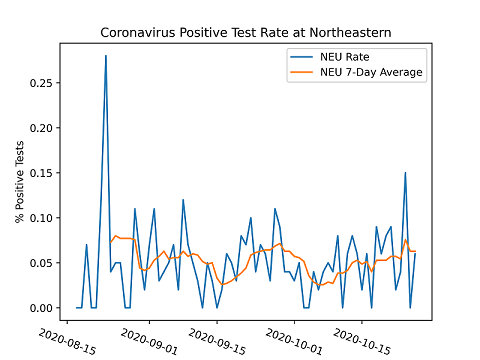

# Northeastern Covid Analytics

A program that takes Northeastern's public covid numbers and performs additional analysis with alternative graphical representations.

## Installation

1. Clone the repo.
2. Import bs4 and matplotlib

## Usage
Run the northeastern_covid_tracker.py file and the output will be saved in its respective directory.

The data will be a .json file in the "data" directory and the graphs will be .png files in the "graphs" directory.

```shell
> python3 northeastern_covid_tracker.py

```

## Example Output


## Contributing
Pull requests are welcome. For major changes, please open an issue first to discuss what you would like to change.

Please make sure to update tests as appropriate.

## License
[MIT](https://choosealicense.com/licenses/mit/)